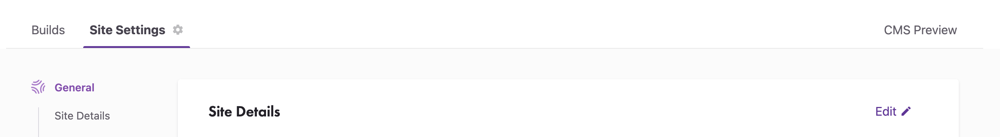

## 블로그 공간을 만들어보고싶다.
회사에서 **닥치고 블로그**라는 모임을 하게되면서 아무런 준비 없이 dev.to 에 글을 올리면서 
`글만 쓰면 된다`라는 생각으로 진입했다가 이번달에 글을 쓸 준비를 하다가 문득 공간을 만들고 
싶은 욕심이 생겼다. jekyll로도 만들어보고 hexo로도 만들어 봤었는데 만들기만 하고 글을 잘 
안쓰다가 요즘 다시 글을 쓰기 시작해서 이참에 gatsby랑 친해져보고 싶어서 첫글은 이걸로..

## 준비
퀵스타트를 보고 시작할까 하다가 [gatsby v3의 튜토리얼](https://www.gatsbyjs.com/docs/tutorial)을 기반으로 시작한다.

gatsby는 command line interface (cli)를 통해서 사이트를 생성하고 개발을 위한 명령들을 
제공해준다.

```bash
npm install -g gatsby-cli
```

배포는 gatsby cloud를 이용하기로 결정했다. 어짜피 개인용이고 가볍게 사용하기 좋아보였다. 
[여기](https://www.gatsbyjs.com/dashboard/signup/) 에서 계정을 만들고 builds와 
hosting 요금제를 설정하면 된다. 가볍게 **Free**로.

## 생성 및 배포
아래 명령어를 실행해보자.
```bash
gatsby new
```

사이트의 이름과 폴더를 설정하고나면 cms를 사용할 것인지 물어본다.

```bash
✔ Will you be using a CMS?
· No (or I'll add it later)
```

그 외에 styling 시스템 설정은 `emotion`을 선택했고 플러그인은
**Build and host for free on Gatsby Cloud** 만 추가했다.
~~튜토리얼대로..~~ 이 후 알아서 만들기 시작한다. 다 쓰고나서 보니 `emotion`은 왜 추가했지싶다..

이제 지정한 폴더로 가서 개발 명령어를 실행하면 화면을 볼 수 있다!
```sh
yarn develop
# 혹은 npm run develop
```

이제 개발 설정은 끝났으니 github에 올려보자.

```sh
git remote add origin https://github.com/내_깃헙_이름/생성한_주소.git
git branch -M main
git push -u origin main
```

이후 위에서 생성한 gatsby cloud의 대시보드에서 사이트를 추가한다.


적당히 선택하되 CMS와 환경 변수 설정은 튜토리얼 대로 건너 뛰었다.

이후 조금 기다리면 대시보드에 연결되어있는 주소로 배포된 결과물을 볼 수 있다. 아마 `내가_설정한_이름.gatshbyjs.io`의 주소로 되어있을텐데 설정을 잘못했는지 숫자로 prefix가 나와서 아래 Site settings에 진입하여 수정하였다.



## 어라?
튜토리얼 문서를 보면서 설정을 해나가다가 블로그를 어떻게 만들지 하면서 문서를 끝까지 읽다보니 문서가 오늘 기준으로 미완성이었다… hul.. 그래서 중간에 blog-theme을 이용하여 구성하는 방향으로 선회했다. ~~아 끝까지 읽어보고 작성할 걸..~~

아래 패키지를 설치한다
```bash
yarn add gatsby-theme-blog
# npm install gatsby-theme-blog
```

그리고 `gatsby-config.js` 파일의 설정을 수정한다.

```json
// gatsby-config.js
// siteMetadata도 수정했다.
module.exports = {
  plugins: [
    {
      resolve: `gatsby-theme-blog`,
      options: {
        // basePath defaults to `/`
        basePath: `/blog`,
      },
    },
  ],
	siteMetadata: {
    siteUrl: 'https://jehoon.gatsbyjs.io',
    title: 'blog jehoon',
    author: 'jehoon.park',
    description: '글 꾸준히 써보려고 만듬',
    // Used for resolving images in social cards
    siteUrl: `https://jehoon.gatsbyjs.io`,
    // Used for social links in the root footer
    social: [
      {
        name: `GitHub`,
        url: `https://github.com/jehoon`,
      },
    ],
  },
}
```

`/contents/posts`에 mdx 파일을 추가한다. 대충 오늘 날짜로 `210715.mdx`를 아래와 같이 생성했다.

```md
---
title: Gatsby로 블로그 만들기
date: 2019-07-15
---

에라이

```

그리고 `/contents/assets` 폴더에 아바타를 추가하자. `avatar`라는 파일 이름으로 png 혹은 jpg면 된다.

`yarn develop`으로 개발 서버를 띄워보고 http://localhost:8000/blog 접속하면 아래처럼 만들어진다.


근데 문제가 있다. 문서 아래 Bio가 이상하게 나온다..


## Shadowing
Gatsby 테마는 `shadowing` 이라는 개념으로 테마에 구성이 되어있는 컴포넌트를 원하는 형태에 맞춰서 대체할 수 있다.

`gatsby-theme-blog`의 파일구조는 아래처럼 되어있다. [여기](https://github.com/gatsbyjs/themes/tree/master/packages/gatsby-theme-blog)에서 테마가 어떻게 만들어졌는지 파악 할 수 있다. 대략 아래 구성처럼 되어있다.

```md
├── gatsby-browser.js
├── gatsby-config.js
├── gatsby-node.js
└── src
    ├── components
    │   ├── bio-content.js
    │   ├── bio.js
    │   ├── header.js
...
```

**jone doe**씨가 어디있나 찾아봤더니 `bio-content.js`에 있다. `bio` 컴포넌트의 컨텐츠 부분인데 이것을 입맛에 맞게 변경하면 된다. `src/gatsby-theme-blog/components` 이 경로에 파일을 만들자.

```js
// src/gatsby-theme-blog/components/bio-content.js
import React, {Fragment} from 'react'
import { Themed } from 'theme-ui'

/**
 * Shadow me to add your own bio content
 */
const BioContent = () => (
  <Fragment>
    Words by <Themed.a href="http://github.com/jehoon">jehoon.park</Themed.a>.
    <br/>
    하하하
  </Fragment>
)

export default BioContent;
```

이제 잘 나온다.

## 근데.. 어..
만들다보니깐 깨닳았지만.. 이럴거면 그냥 잘 만들어진거로 시작할걸.. 이란 생각이 문득 들었다.
삽질하느라 재밌긴 했는데 왜 새벽인건지. 다음 주제는 shadowing 및 커스텀으로 가야겠다.
typescript도 넣고 prettier도 붙여야지..


## 마무리
퇴근하고 7시간동안 블로그 만들고 글로 작성한다고 자료 찾아보다가 하루가 넘어가고
(~~진짜 모임 들어오기 전까지 내용 하나도 안찾아보고 그냥 쓰면 되겠지 했던 어제의 나를 욕했다~~)
블로그 테마 구경하다가 다른 사람들 블로그 글 읽으면서 시간 다 보냈는데…
이제 꾸준히 글 쓰려고 블로그 만드는데 시간을 썼으니 의식적으로 잔디라도 깎아야겠다.

다 만들고 보니 기본 테마 간격이 묘하게 눈에 안들어오는거같기도 하고..