# Deploy a Next.js blog using Strapi on Vercel 따라하기 - WIP

https://www.youtube.com/watch?v=zE1S8CHkev8 이 영상을 기반으로 정리.
회사에서 Jamstack을 활용해서 적극적으로 해결할만한 문제를 찾아서 이참에 리서치도 해보고 구현해보면서 정리한다.

정리하면서 할려니깐 시간 너무 오래걸리는데 흠..

두명의 엔지니어가 대담을 나누는 형식이라 대략 만들어 보면서 대화하는 내용도 요약 정도로 정리해본다.
이거 다 쓰면 strapi로 블로그 옮기는 작업 해야겠다 mdx 관리 귀찮구나.. 

## JAM stack

첫 소개에서 JAM stack에 대한 소개를 진행한다. 좋은 글들을 많이 찾았는데 [공식문서?](https://jamstack.org/)에도 소개가 잘 되어있고, [url 어그로로 들어가봤던 이 사이트](https://jamstack.wtf/)도 굉장히 정리가 잘 되어있다. (좀 재밌었다 ㅋㅋㅋ)

Jamstack wtf(…)에서 `Jamstack은 더 단순한 개발자 경험, 더 나은 성능, 적은 비용 및 높은 확장성을 제공하여 웹 구축에 대한 우리의 사고 방식을 혁신했다.` 는 문장으로 시작되는데 `JAM`은 아래와 같이 이루어져있다.

### JAM

* JavaScript: 동적 기능은 자바스크립트에서 처리하며, 사용해야하는 framework나 library에 제한이 없다.
* APIs: 서버 측 작업은 재사용 가능한 API로 추상화 되고  Javascript로 HTTPS를 통해 엑세스 한다. third party 서비스 혹은 커스텀 기능일수 있다.
* Markup: 웹 사이트는 정적 HTML 파일로 제공된다. 정적 사이트 생성기를 사용해 Markdown과 같은 소스 파일로 부터 생성될 수 있다.

그 외의 Jamstack의 특징에 대한 설명들을 해준다.

### Why Jamstack
* Better Performance
    * 배포 시간에 페이지를 생성함
    * CDN을 통해 사전에 빌드된 마크업 및 asset들을 제공
    * CDN을 통해 제공되는 사전 빌드된 파일보다 더 좋은것은 없음. 공식 문서의 문장을 요약한거같은데 time to first byte(ttfb)를 최소화 하는데 이게 제일이라고. (When it comes to minimizing the time to first byte, nothing beats pre-built files served over a CDN.)
* Higher Security
    * microservice api는 공격을 줄여줌
    * third-party 서비스는 부지런히 모니터링 하며 그들의 서비스의 보안과 가용성을 유지보수함.
* Cheaper, Easier Scaling
    * 정적 파일을 호스팅 하는 것은 저렴하거나 무료임
    * 확장은 이러한 파일을 더 많은 위치(places)에서 제공하는 문제임. (요약 되어있지만 CDN이 이러한 문제에 완벽하게 대응된다.)
* Better developer experience
    * (위의 이유들로) 프론트엔드에 집중할 수 있음
    * 모놀리식 아키텍쳐를 제거함으로써 보다 빠르고 집중적인 개발.
    * CMS를 사용할 때 분리된 스택을 유지보수할 필요가 없음 (A ㅏ..)

그래서 heroku, strapi, vercel, next.js를 활용하여 블로그를 개발 해본다.

## Strapi
* 특징
    * open source !
    * customizable
        * 각 프로젝트는 요구사항에 맞게 커스텀할 수 있음.
    * 100% js
    * self-hosted
    * RESTful or GraphQL
    * 디자인에 따라 확장 가능 (플러그인 시스템)

Strapi는 컨텐츠를 제공하기 위해 self hosted, customizable 그리고 성능좋은 API를 구축할 수 있도록 지원한다. 컨텐츠와 API의 모든것.

영상에서는 블로그를 위해 `—quickstart` 옵션으로 새로운 strapi 환경을 만드는데 [여기 저장소](https://github.com/strapi/strapi-starter-next-blog)에 위 영상에서 결과로 나온 프리셋 형태의 구조가 이미 다 만들어져있다.

### 설치

아래 명령어로 strapi 환경을 구성하자.

```bash
npx create-strapi-app my-project --quickstart
```

그러면 설치가 완료되고 알아서 `strapi develop` 스크립트를 실행한다. 다음에 실행할 땐 `yarn develop` 같이 본인이 사용하는 패키지 매니저로 실행시켜주면 된다.

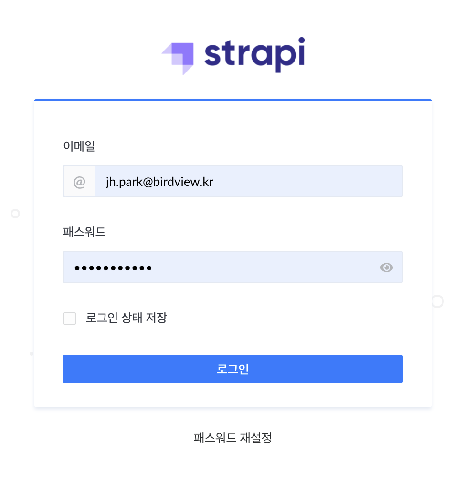

처음에 레지스트 하는 화면을 못찍었는데 다시 설치하기 귀차….아니 못찍어서 로그인 스샷으로 대체한다. 이때 슈퍼 유저를 생성한다.

그럼 아래 화면을 만날 수 있다. (한글이다. 세상 좋아졌다 진짜)

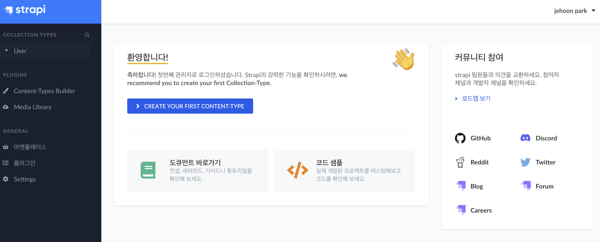

파란 버튼인 `create your first content-type`을 눌러보면 첫 컬렉션을 만들어볼 수 있다. 블로그를 만드려하니 그에 필요한 `article` 컬렉션을 만든다.

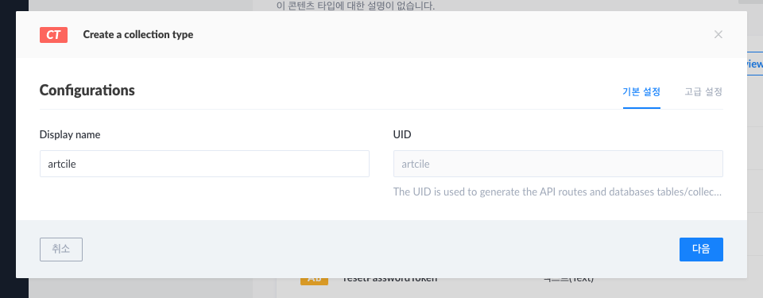
아..오타있네..

그리고 다음을 눌러 아래와 같은 필드를 생성한다. 화면은 반복됨.

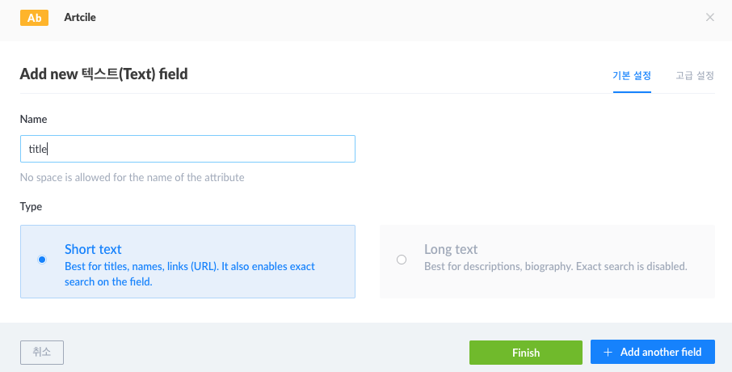

* title: text
* content: rich text
* image: media (single media)

> 영상에는 `published_at` 이름의 필드를 만들라고 하는데 This name cannot be used in your content type as it might break other functionalities 이런 메세지로 에러가 나오면서 등록이 안된다. 코드를 뒤져보니깐 reserved-name 에러 메세지인데 영상을 만들었던 시점에 업데이트가 한번 있었나보다. 이후에 생성된 데이터를 보니 published_at이 기본으로 들어가있다.

이제 `article`들의 카테고리 타입을 관리해 줄 `category` 컬렉션을 만든다. `+ Create new collection type`을 눌러서 생성하자.

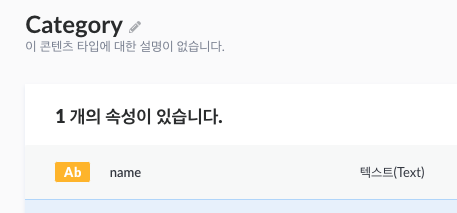

이제 두 컬렉션을 relation 시킨다. 새 필드 생성에서 관계를 선택하고

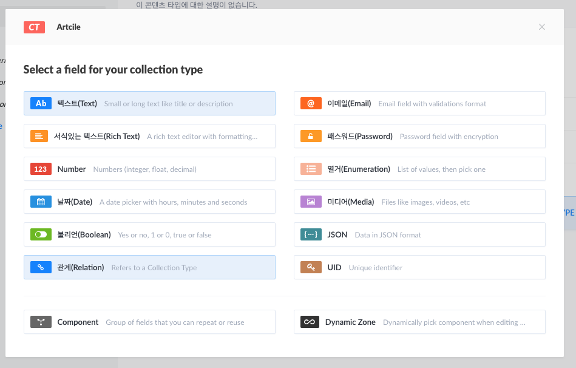

`Category`는 많은 `Article`을 갖으니깐 그림처럼 연결.

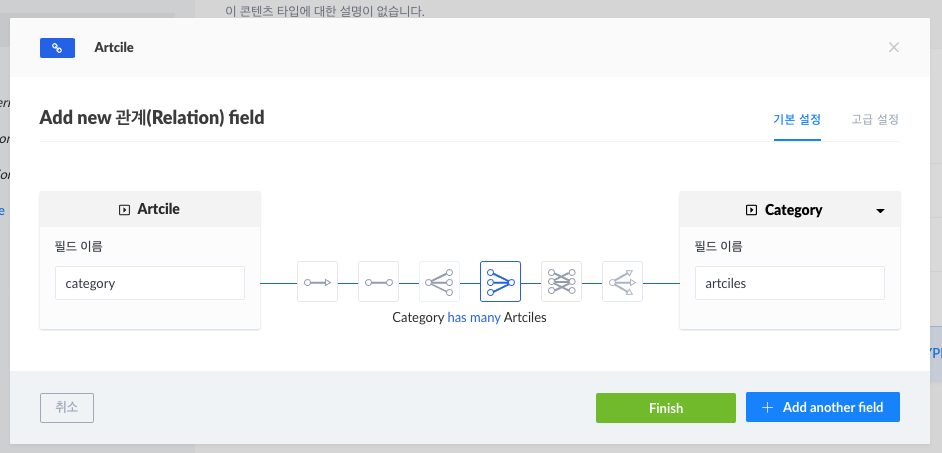

좌측 상단에 categories가 생겼는데 하나 추가해본다.

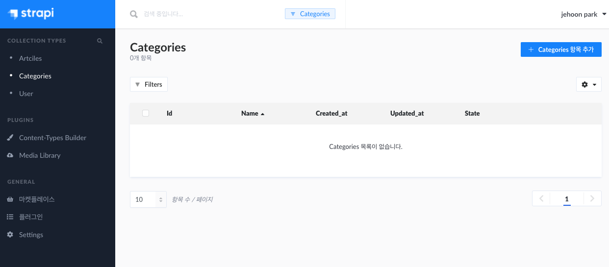

이제 글도 작성해보자. 사진이 보쌈인건 넘어가자.

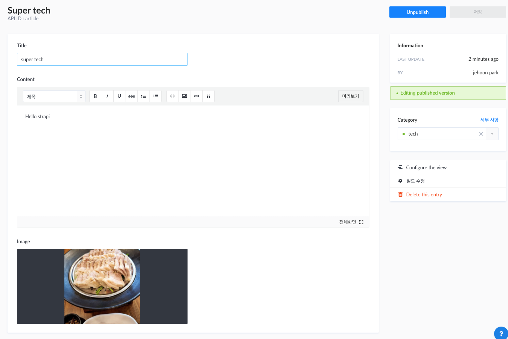

그리고 이제 저장한 항목을 접근할 방법에 대한 내용이 나오는데 Roles and Permissions 항목으로 가서 권한 설정을 해줘야한다. 영상이랑 다르게 strapi가 버전업이 되서 아래 위치에 있다.

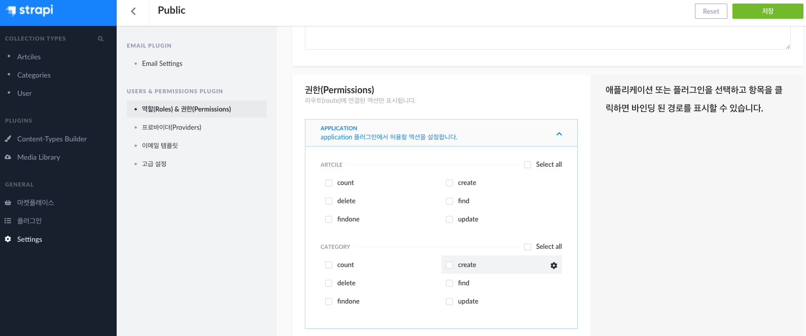

여기서 find 권한을 설정해주면 `/articles`, findone 권한을 설정해주면 `/articles/:id`로 데이터를 볼 수 있게 된다.  고급 설정에서 `isauthenticated` 같은 설정으로 권한 부여가 별도로 가능해 보인다. (아직 안해봄)

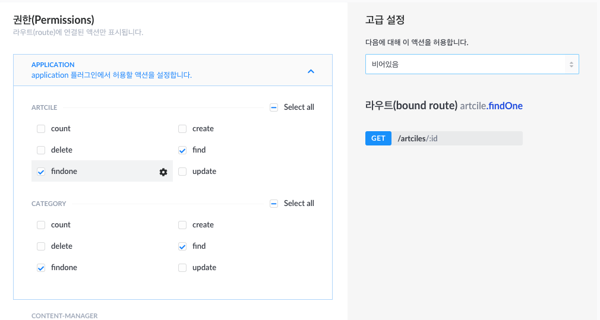

이제 저장 누르고 `http://localhost:1337/articles` 를 확인해보면?

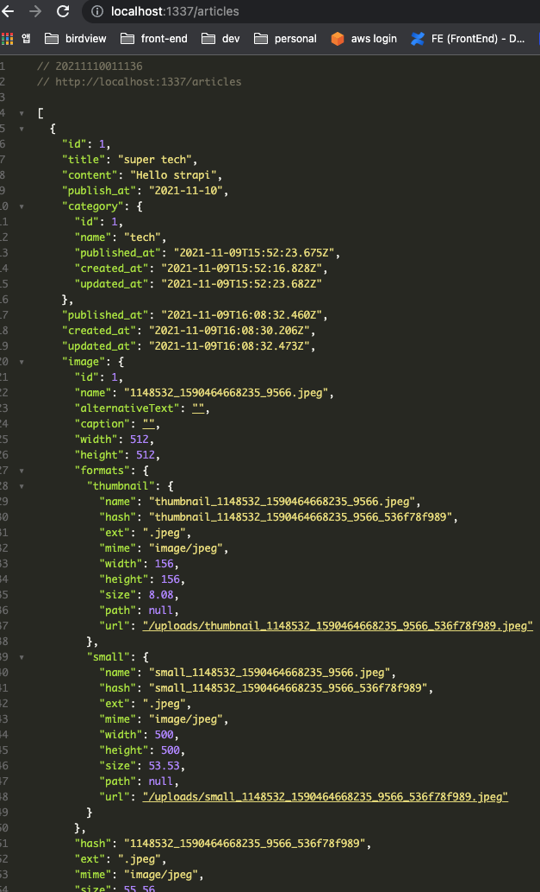

데이터가 잘 조회되는 것을 확인할 수 있다.
이 다음 스텝은 Heroku에 strapi를 올리는 작업을 하는데… 아 오늘은 여기가 한계인것 같다. 이어서 계속 올릴 예정이다.

계속 업데이트 예정