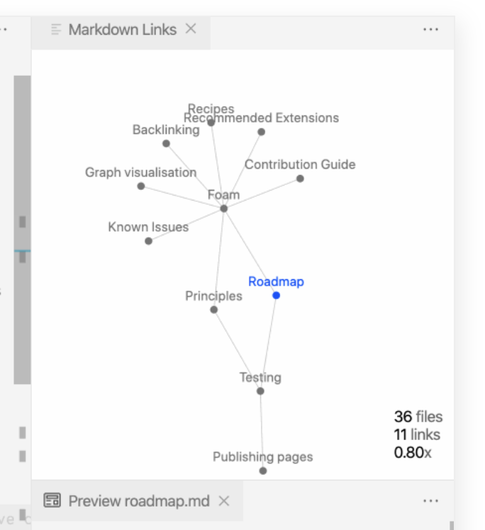

매번 가볍게 쓰는 느낌이긴한데...

## 시작

21년 4분기 프로젝트를 진행하다가 graph 관련 기능을 구현해야되서 관련 내용을 리서치 하고 결국은 G6라는 그래프 라이브러리 (소개문구에는 graph visualization engine 이라고 써있다.)를 사용하게 되었다.
개인적인 사용 소감은 대륙의 실수같은 느낌이었는데 결국 현재 프로젝트에 도입을 하였고, 진행하면서 했던 내용들은 정리를 조금씩 하려 한다.
strapi 관련 글도 이 프로젝트의 일환으로 테스트를 위해 진행했던건데 너무 바빠서 2편은 작성도 못했네..

## React에서 graph를 뭘로 구현할 수 있을까

react로 graph를 그려야했다. 아래 이미지는 [foam](https://foambubble.github.io/foam/)에서 가져왔다.

순수하게 graph를 위한 라이브러리가 필요했다.
그리고 진행 기간이 1.5개월로 굉장히 짧은 프로젝트에 할게 많았었기 때문에 빠른 프로토타입 과정까지 갈 것이 필요했다.

### 후보군 d3 with react

기억을 더듬으며 막연히 svg로 그래프(네트워크) 형태로 그릴수 있는 것이 무언가 있을것 같았고 d3가 후보군으로 먼저 떠올랐다.
foam에서 좌표가 겹치지 않게 그래프 형태를 어떻게 만들까 궁금해서 어떻게 구현했는지 확인해봤는데 `d3.force` 함수가 눈에 띄었고 보니깐 [d3-force](https://github.com/d3/d3-force) module을 사용하고 있었다.
좌표를 어떻게 계산해서 배치하는지 궁금했는데 force가 함께 하는구나! 이전 회사에서는 d3를 깊게 써보진 못했고 유틸 함수들만 사용을 해보았다.

그래서 d3를 react와 어떻게 함께 사용할까?

그 고민에 관련된 내용을 굉장히 잘 정리해준 아티클이 [여기](https://www.smashingmagazine.com/2018/02/react-d3-ecosystem/) 있는데 요약하자면 react도 렌더링을 virtual dom으로 별도로 관리하는데 d3도 dom을 직접 조작하니 어느 한쪽에 렌더링 사이클을 몰아주던지, 라이프 사이클을 잘 믹스하던지 아니면 d3의 수학 관련 모듈만 사용하던지였다.
(react-faux-dom 얘기도 있는데 현재 시점에 아카이브 된 레파지토리고 d3 때문에 react에서 쓰려고 다른 virtual dom을 또..? 글쎄요..)
이런 내용인데 결국 읽어보고 마지막의 d3로 렌더링 하는게 아니라 svg를 react 컴포넌트로 만들어서 사용하고 d3의 수학 계산 모듈들만 가져다 쓰는 방법이 제일 방법적으론 나아보였다.
그렇게 접근 하는 방법들이 아래의 라이브러리들이었음

* [nivo](https://nivo.rocks/#/)
* [vx](https://vx-demo.vercel.app/)
* [recharts](https://recharts.org/en-US/)

그럼 이제 react에서 d3를 사용하는 방법적인것은 더 고민해보면 될것 같은데 svg를 사용하는 d3가 해결하려는 솔루션에 적합했는지 검토를 해보자 했다.
지금 진행해야하는 프로젝트는 노드 갯수가 대략 몇백개에서 몇천개 수준으로 확장될 가능성이 보였다. 퍼포먼스 괜찮을까? 아니면 canvas나 webgl을 react에서 관리하고 `d3-force` 만 활용해볼까?
svg로 관리를 고민하는 것 보다 아예 그래프를 그리는 라이브러리를 전면적으로 뒤져보자.
넘어가기전에 번외로 [regl이라는 webgl 라이브러리로 d3랑 조합한 것](https://bl.ocks.org/pbeshai/66f1a837ec33f787dace43e1b5039e31)도 보였는데 재밌어보이는데 읽다가 이건 지금 시점엔 무리겠다 싶어서 넘어갔는데 나중에 webgl 고려할 때 참고하려고 세이브.

### graph rendering using canvas with react

[canvas와 svg 뭘 고름?](https://docs.microsoft.com/en-us/previous-versions/windows/internet-explorer/ie-developer/samples/gg193983(v=vs.85)?redirectedfrom=MSDN)에서 설명이 잘 되어있었고,
[유지모드와 즉시모드 설명이 잘 되어있는 dom vs canvas 글](https://www.kirupa.com/html5/dom_vs_canvas.htm)도 설명이 잘 나와있었다. 개념적으로 다시 한번 정리가 되었는데 노드 갯수가 많다면 svg가 불리할 수 밖에 없겠구나 싶었다.
그럼 canvas를 써야되나?

...싶다가 여러 자료들을 많이 뒤져봤었는데 CascadiaJS(개인적으론 처음봤다..) 2020에서 발표한 [SVG, Canvas, and WebGL: The Power, the Beauty, and the Cost](https://www.youtube.com/watch?v=wjtfQ8NI2T8)에서 내용을 보다가 [예시로 사용된 코드가 있는 저장소](https://github.com/ahoak/renderer-benchmark)를 찾아서 돌려봤다.
좀 이상하다 싶을정도로 svg 예제는 퍼포먼스가 좋고 canvas 예제는 퍼포먼스가 너무 안나오길래 뭐지 싶었는데 코드를 보니 `pixi.js`로 canvas 렌더링을 하고 있고 애니메이션도 requestAnimationFrame으로 직접 돌리는것과 다르게 svg는 d3의 transition을 활용하고 있어서 아주 동일한 비교군으로 보긴 어려울것 같고 `webgl ㄷㄷ` 이런 느낌만 받고 다음으로 넘어갔다.

### webgl???

network graph 검색해보면 webgl을 사용한다고 바로 나오던것 중에 흥미가 생긴건 [sigma.js](https://www.sigmajs.org/) 였었다. 당시 구현해야하는 형태를 예제로 가장 유사하게 갖고 있었고 `역시 webgl?` 이런 느낌으로 빨랐다. 
구성이 좀 신기한게 sigma.js 자체는 rendering/interaction 엔진이고 실제로 graph 구성을 위한 graph 관련 로직은 [graphology](https://github.com/graphology/graphology)라는 별도의 라이브러리를 사용한다.
내용을 좀 보고 예제도 훓어보고 느낀게..

> 문서는 코드에 있네...Orz

보면 볼 수록 react 예제라고 나와있는 sigma.js를 react에서 쓰라고 만들어준 건 real world 예제 느낌이고 따로 구현해서 써야할 것 같은데 sigma.js 코드 보면서 기능 파악해야되고 graphology 훓어보다가 시간을 꽤 보내야할것 같은 생각이 바로 들었다. (그나마 graphology는 문서가 조금이라도 있다.)

그 외에 데이터 조각라고 소개하는 어떤 [메인테이너의 저장소](https://github.com/vasturiano)를 보고 여기도 꽤 재밌게 봤다. [이런 예제](https://vasturiano.github.io/react-force-graph/example/highlight/) 라던지.
개인적으론 적용 직전까지 고민할 정도로 괜찮게 봤는데 이후에 알게된 g6때문에 전환.

시간이 굉장히 한정적이었고 리서치를 아주 딥하게 할 수 없었다 보니깐 원하는 기능도 어느정도 갖춘것들은 많이 보았는데 빠른 시간에 구현할 수 있을지도 걱정이었다가 [g6](https://g6.antv.vision/)를 알게 되었다.
개인적인 webgl로 만들어진 graph들을 보면서 시간이 주어진다면 좀 더 파보고 이쪽으로 선회해도 충분히 재밌는 과제로 만들수 있겠다 싶었다. 근데 커스텀이나 노드에 다양한 어떤 기능을 붙여볼려면 시간이 많이 필요해보였다. 다 직접 만들어야되서.

### g6

위의 내용 정리하는데도 시간이 좀 걸려서 g6는 이전에 구현한것 정리할겸 2월에 집중해서 적어보려 한다. 
한줄평이라면 canvas 기반이고 대륙의 실수같은 느낌인데 중국어 압박이 너무 심한거 빼곤 많은 고민을 한 티가 나는 라이브러리였다.

아래는 그냥 부차적
* gpuEnabled 옵션이나 worker를 별도로 사용하는 부분도 있고, 내부적으로 다양한 force-layout 방법들, 그래프 관련 알고리즘들, 커스텀 용이하게 고민한 node/edge 커스텀, 다양한 optional 컴포넌트.
* gpuEnabled가 뭘 쓰길래 gpu 쓴다는건지 궁금해서 봤더니 내부적으로 `OffscreenCanvas`를 [사용](https://github.com/antvis/G6/blob/6c0bc69e213705e0f6a0eff0d9c0cc59da6bd9a0/packages/pc/src/graph/controller/layout.ts#L347)하고 있었다. 이~~~~~전에 컨퍼런스에서 봤던거고 지금 사용이 가능한건가 싶었는데 재밌었다. 여기도 공부할 포인트를 잡은거같음.
그리고 코드 까보면 typescript로 작성되어있는데 속성이 전부 `xxx.get(key)` 방식으로 인터페이스를 통일해놔서 key가 string 타입인데 뭔지 알려면 문서를 봐야되고 문서가 중국어다..... (주석도 중국어다... typescript 왜 쓴거야ㅠㅠ)
다행히 구글 번역이 굉장히 잘된다고 느꼈고 문맥 파악에는 어려움이 없었어서 번역기와 함께 1달동안 같이했다...
* 이건 진짜 여담이지만, 문서가 en버전으로 별도로 관리가 되서 당연히 중국어 홈페이지 (문서가 중국어/영어 두개임)랑 똑같겠지 하고 봤는데 중국어쪽이 좀더 최신이거나 내용이 갱신된게 있다. api 문서 보면서 구현하다 typescript에서는 잡히는데 왜 api 문서에 없지 하고 봤더니 중국어 문서에는 있음...ㅎ..ㅎㅎ.하ㅏㅏㅏ.. 그 뒤로 구글 번역 항상 켜놓고 중국어 문서만 봄..

그럼 다음주에 이어서 다시 써야겠다!

