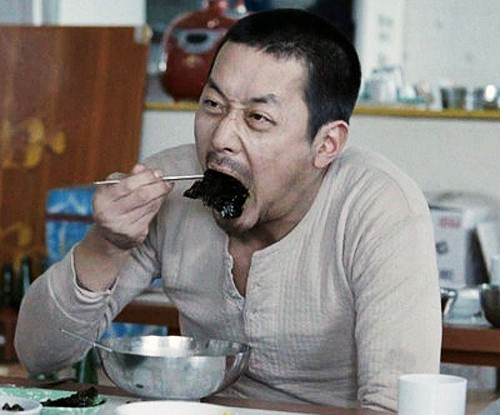
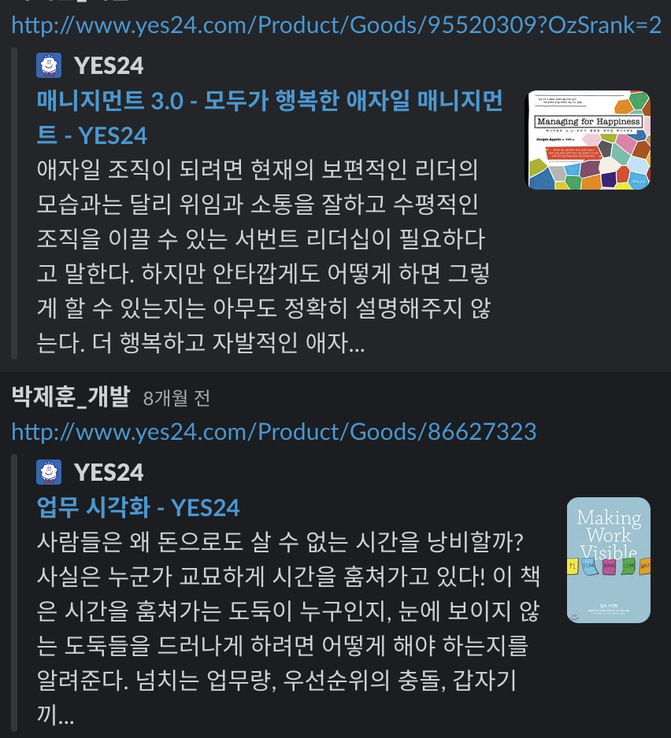
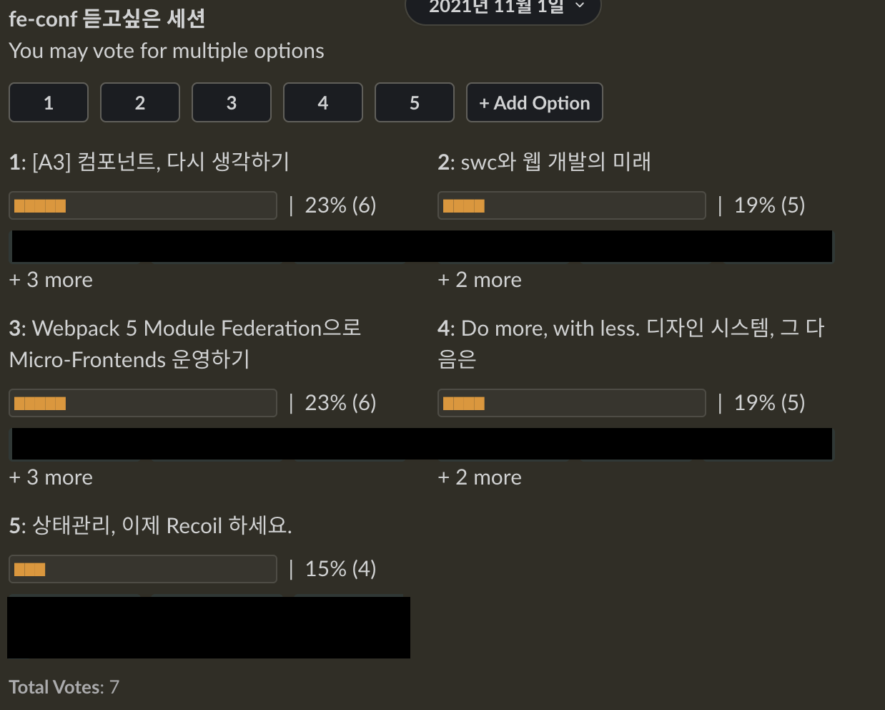
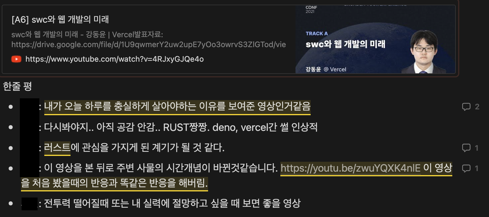
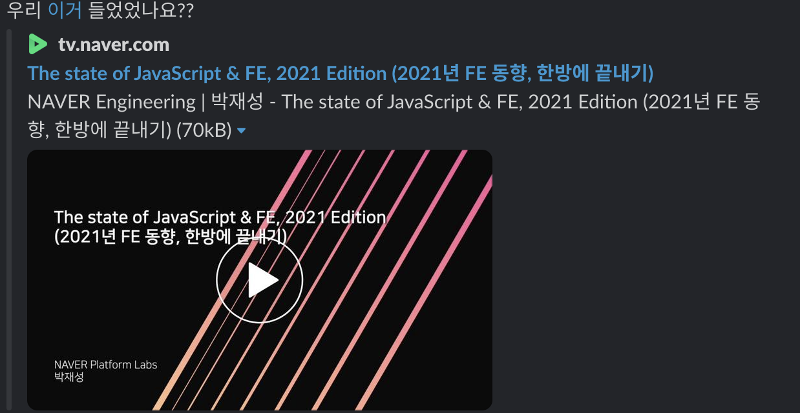
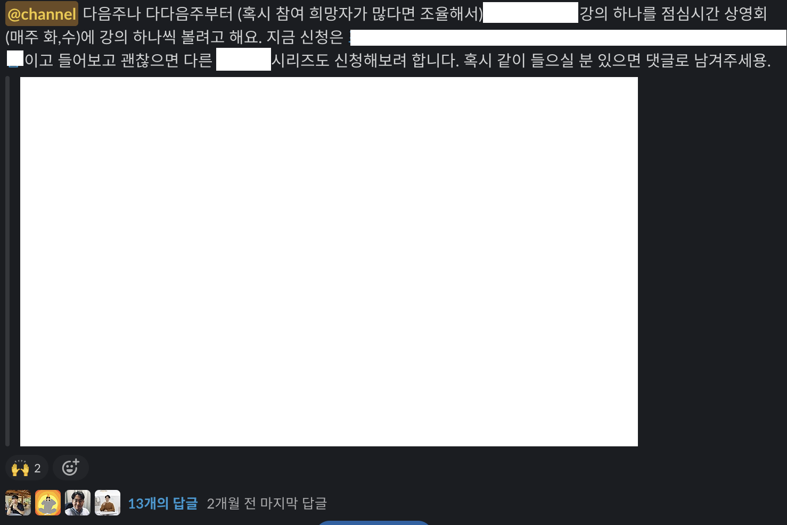
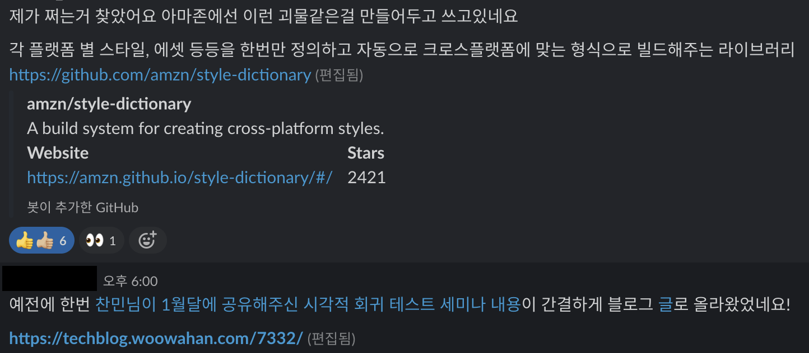
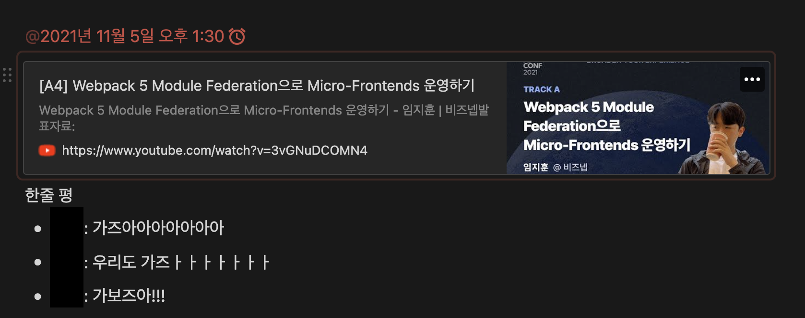

# 보쌈 먹으며 프론트엔드와 친해지기
제목이 쌩뚱 맞을 수 있지만 오늘의 주제는 작년부터 시작하고 비교적 성공적으로 유지되고 있는 프론트엔드 팀의 문화를 이야기 해보려 한다.

## 밥먹으면서 영상보기

버드뷰에 입사하고 재택 근무로 거의 2년을 지내다보니 몇몇 기간을 빼곤 점심에 거의 영상을 보면서 밥을 먹었다. 혼자 밥먹으면 적적하기도하고 예전부터 영상을 꼭 보던 습관이 있었다. 그동안 정말 다양한 주제의 영상들을 봤었는데 가벼운 유투브, 영화, 드라마, 한동안은 부동산, 주식 유투브만 보다가 개발 관련 영상들도 많이 봤던것 같다.

이런 패턴들이 당연해져가던 작년 8월경에 개발팀의 백엔드 리더분께서 밥먹으면서 영상을 같이보면 어떻겠냐고 말씀을 주셨었다. (그때봤던 [영상](https://www.youtube.com/watch?v=ahZ6qsWG-OM)) 당시에 오프라인에서 한번 밥먹으면서 영상 본적은 있었는데 재택에도 괜찮을것 같은 느낌도 들었고, 원래도 그렇게 생활해왔고 또 평소에 관심있던 주제였던 것 같아서 지원하고 같이 봤었다.

영상의 내용도 괜찮았었는데 이 때 느꼈던 좋았던 점은 관심있는 주제를 함께 보고 이후에 이야기하는 스몰 토크 자리였다. 이미 알고있는 내용에 대해서는 경험했던 이야기를 들려주거나 부연설명 해주고 새로운 것을 알게되는 것이 너무 좋았던것 같다. 내 의견에 대한 피드백을 들을수 있는것은 덤이다. 그래서 플랫폼에 돌아와서 경험을 공유하고 우리도 언젠가 한번 해보자 화두만 던지고 시간이 흘렀다.

*저는 이 책과 아무런 관계가 없습니다.*

이때 봤던 영상의 강연자분이 작성하거나 번역한 책도 이 기회에 사서 봤었다.

## 시작은 컨퍼런스 부터
때는 10월 fe conf 2021이 진행되던 시기였다. 코로나덕분에 영상이 온라인으로 공개가 되었고 처음부터 밥먹으면서 하나씩 볼려고 계획을 했었다. 그러다 8월이 생각이 났다. 그리고 플랫폼에 던져봤다.

> 혹시 같이 보실분 있나요?

예전부터 플랫폼 문화가 성장에 목마른 분들과 문화 활동에 적극적인 분들이 많아서 인원이 자연스럽게 모여졌고 업무에 방해되지 않는 선에서 같이 볼 수 있는 시간을 탐색해보니 점심시간으로 결정이 되었다. 처음엔 많은 세션중에 관심사가 높은것들을 투표해서 먼저 보고 이후에 남은 것들을 보는 방향으로 잡았고 같이 보기로 한 인원들 끼리 참석은 자율로 두고 시작을 했다.

그러다보니 자연스럽게 관심사가 높았던 주제는 참여율이 높았고 아닌 것들에서는 참여율이 적었던것 같다. 하지만 꾸준히 참여해준 멤버들 덕분에 무사히 컨퍼런스의 모든 내용을 볼 수 있었다.

이전 백엔드 리더분이 제안했던 영상회 첫 경험처럼 영상을 다 보고 스몰 토크를 통해서 알고있던 내용은 경험이나 지식들을 공유하였었고 새로운 지식들은 신선한 충격을 받으면서 공부할 재료들을 많이 모았다. 이런 활동을 혼자 밥먹으면서 곱씹는게 아니라 관심사가 같은 분들과 함께 이야기하고 의견을 나누는 것이 정말 좋은 경험이었다. 또한 너무 무거운 혹은 학습하며 들어야하는 주제보다는 프론트엔드 동향이나 경험 혹은 훓어보기 정도의 조금은 가볍게 들으면서도 인사이트를 얻을 수 있는 영상들이었다보니 밥먹으면서 보는게 부담스럽지 않았었던게 좋았었다.

## 이 다음은 뭐 하지?
처음 잡았던 컨퍼런스를 다 보고 같이 보던 멤버들과 이후의 방향을 얘기해보았었다. 처음 목적이 fe conf 2021이었다보니 전부 다 같이 본 이후에 대해서는 별 생각이 없었었다. 하지만 나와 비슷하게 영상회 자체에 대한 만족도가 있으셨던 분들이 꾸준히 진행하기를 희망해서 이후에는 열리는 컨퍼런스들 혹은 열렸던 컨퍼런스 영상들 중에서 관심있는것들을 영상회 전까지 제안하는 식으로 변해갔다. 그래서 처음은 fe conf 영상회라는 소모임으로 시작했다가 fe-영상회라는 활동으로 확장했다. 처음 영상회에 참여하지 않는 분들께도 주기적으로 홍보했던것 같다.

fe conf를 볼 때는 영상 봤던것을 기록하고 한줄평도 남기는 식으로 진행하다가 어느새 기록은 잊지 않았을때 한줄 씩 적게 되었다. 영상을 보는것 그리고 이후 10분에서 길게는 30분정도 영상에 대한 이야기를 나누는 것이 중요하다고 생각했었기 때문에 조금 번거로운 작업들이 참여율에 영향을 줄거라 생각하고 강제하지 않았었는데 지금 생각해보면 꾸준히 작성하는 것이 회고처럼 남았을 것 같아서 아쉽게 느껴진다.

참여도 필참이 아니었어서 매주 2회 진행하다 보니 정기적인 날짜를 되도록 많이 참여할 수 있는 날짜로 변경도 해보고 했었는데 한동안 2~4명이서만 보는 상태로 한동안 지속됬던 적도 있었다. 지금은 매주 화,수로 고정시켰다.

영상을 보면서 밥을 먹다 보면 점심에 다른일들을 해야하는 경우 가끔 불참하고 싶을때가 있긴 했었는데 내가 손을 놔버리면 자연스럽게 없어질 것 같아서 꾸준히 참여하는것을 목적으로 했다. 하지만 결국 내 개인사정이 있을 땐 가끔 불참했지만 다른분들이 참여해줌으로써 영상회는 이어져갔다.

영상 봤던 기록도 슬랙으로만 남기고 참여인원도 불규칙적으로 되다보니 봤던걸 다시 제안하는 경우도 가끔 있었다. 그렇게 약 4개월 넘게 여러 컨퍼런스 영상들을 수집하면서 시청하고 시간이 흘러갔다.

## 이후에 프론트엔드 강의 같이 보기
작년부터 프론트엔드 비전 중에 `프론트엔드 플랫폼에 합류하면 반드시 성장한다.` 라는 패기로운 목표를 잡았었고 다양한 성장이라는 목적을 갖는 활동들을 해왔었다.

작년까지는 개인 성장의 공유에 초점을 맞췄지만 공동 학습에 초점을 맞춰서 무언가 했던 활동들은 적었던 것 같았다. 그래서 올해 초에 목표를 잡을 때 프론트엔드 학습 루트도 잡아보려 계획했다. 다만 무에서 유를 창조한다기 보다는 성장에 도움이 되는 질좋은 영상들을 모아서 학습하는 방향으로 고민을 했었다. 최근 눈에 띄던 강의가 있었는데 커리큘럼 내용을 봐도 크게 무거운 주제보다는 프론트엔드 개발자로서의 방향성을 잡아줄 것 같은 느낌이었어서 강의 시청으로 주제를 선회해보았다.

*저는 이 강의와 아무런 관계가 없습니다.*

학습으로 주제를 바꾸니 주제에 흥미가 생기신 분들이 다시 참여를 시작하였고 약 2달간 첫 강의를 다보고 지금은 다른 강의를 보면서 상영회를 이어나가고 있다. 앞으로는 정해놓은 강의가 다 완료가 되고 다시 컨퍼런스 기간이 돌아오면 컨퍼런스와 강의를 유연하게 선택해서 보려고 계획하고 있다.

## 그래서 밥먹으면서 보는게 효과가 있어?
영상이라는 매체는 정해진 시간만큼 내 시간을 써야하기 때문에 업무를 하는 평일은 저녁에 시간을 따로내서 보려면 약간의 허들이 존재한다고 생각한다. 그래서 요즘은 짧은 요약 영상이나 자막이 제공되는 영상을 배속을 올려서 보는 방법이 많이 쓰인다고 들었다.

개발자가 공부를 하는 것은 특정한 주제를 잡고 깊이있게 공부하는 것도 중요하지만 실무에 쓰이는 기술들이나 지식들에 대한 트렌드 혹은 내용들을 지속적으로 쫓아가는것도 중요하다고 생각한다. 나는 주제들이 핫한 컨퍼런스들도 그 해 유효했던 실무에 적용된 혹은 적용될 고민들을 공유해주는 매우 고마운 시간이라 생각하고 의식적으로 찾아다녔었다. 그리고 우리에게 유익하다고 생각하는 영상이나 글들을 공유하는 채널을 플랫폼 내부적으로 만들어서 서로 공유하고 있었지만 결국 보는 것은 시간이고 관심사가 있는 경우 보는 경우가 더 많았던 것 같다. `예전에 채널에 올렸던 그 글이요!` 몰랐던 경우가 더 많았다.

하지만 영상회를 통해서 약속된 공동의 시간을 잡고 영상을 같이 보면서 동료들이 내가 공유하고 싶은 내용을 보는 시간을 기다릴 필요 없이, 동료들과 같이 보고 주제에 대한 이야기를 나누는 시간을 단축시킬 수 있었고 우리 서비스에 잘 녹일수 있을만한 다른 회사의 고민들도 공감하고 배웠던것 같다. 어찌보면 일을 더 잘하기 위해 학습을 하는 것인데 같은 목표를 바라보고 있는 동료와 시야를 같이 넓혀간다는 것은 즐거운 일인것 같다.

*진짜 갔다..*

fe conf 상영회때 봤던 module federation의 경우 현재 업무에 적용하고 있는데 이때 영상을 같이 보지 않았으면 공감대 형성을 위한 별도의 시간을 들여야했거나, 우리의 방향성에 대한 작은 대화들을 조금 더 늦게 나눴을것 같다. 이때 대화했던 공감대가 우리가 module federation을 적극적으로 도입해 볼 수 있게 되었던 작은 불씨가 되었던것은 부정할 수 없다. 영상회가 이런 역할을 (아주 가끔) 해주기도 한다.

그래서 정리하자면 진행했던 약 6개월이 조금 넘는 시간동안 꾸준히 영상을 봐왔던 것은 내 지식을 넓혀주고, 우리의 지식도 넓혀주고, 업무에도 좋은 영향을 주는 멋진 활동이었다고 생각된다. 그리고 지금도 새로운 참여자들과 즐겁게 시청중이다.

## 끝
보쌈 먹으면서 프론트엔드와 친해지기라고 작성한 제목이긴 한데 그래서 보쌈은 먹었는지 궁금하진 않겠지만 진짜로 보쌈먹으면서 영상을 본적이 있었다. 다양한 점심 메뉴들과 함께 매주 영상을 봤다.

*원할머니 존맛… 저는 원할머니와 아무런 관계가 없습니다.*

문화를 만드는것은 항상 어렵다. 제안자가 없이 다른 사람도 취지를 이해하고 함께 활동해줘야 비로소 문화라고 부를수 있는거라 생각되는데 다행히 플랫폼에서 이런 활동들을 많이 도와주고 호응해줘서 작은 문화로서 만들어진 것 같다. 회사에도 유익하면서 나에게도 그리고 모두에게 유익할 수 있는 유지될 수 있는 문화가 되도록 잘 이어져 나갔으면 하는 마음에 이만 글을 마친다.

